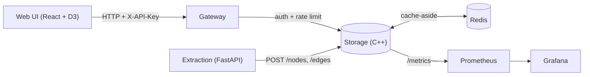

# CortexKernel

[](https://github.com/suryacks/CortexKernel/actions/workflows/ci.yml)
[](LICENSE)

A bi-temporal knowledge graph platform that tracks not just facts about a
person, but a typed distinction between what someone **says** they
believe (`StatedValue`) and what they actually **do**
(`BehaviorEvidence`) — enabling automatic detection of contradictions
between stated values and observed behavior, and a five-state
classifier for how a belief drifts over time.

That typed-edge distinction is the one genuinely novel idea in this
project (checked against Graphiti, Mem0, and MnemeBrain — none of them
make this specific comparison). Everything else — the storage engine,
caching, gateway, orchestration, observability — is engineering built to
support that idea, not claimed as novel itself. See
[docs/CONTRADICTION_DETECTION.md](docs/CONTRADICTION_DETECTION.md) for
how it actually works.

## Architecture



Five services: a C++ storage engine at the center, a Python API gateway
(auth + rate limiting), a Python extraction service (text → graph
candidates), a Redis cache, and a Prometheus/Grafana observability
stack. Full breakdown in [docs/ARCHITECTURE.md](docs/ARCHITECTURE.md).

## Quickstart

```bash
docker compose up -d
curl -H "X-API-Key: dev-key" http://localhost:8090/health
curl -H "Content-Type: application/json" -X POST http://localhost:8082/extract-and-store \
  -d '{"text":"I value my health. I worked on the project all night.","source_ref":"demo"}'
curl http://localhost:8080/contradictions
open http://localhost:3000   # Grafana
```

More ways to run it (bare-metal build, Kubernetes via `kind`, Helm, the
frontend dev server) in [docs/DEPLOYMENT.md](docs/DEPLOYMENT.md).

## It's actually been run, not just written

Every piece of this system has been deployed and exercised for real
during development, not just compiled:

- The full 7-service stack, brought up together with `docker-compose`
  and hit with real HTTP traffic through every layer (gateway → storage
  → Redis, extraction → storage).
- The entire stack deployed to a real local Kubernetes cluster (`kind`)
  — all 5 pods reaching `1/1 Running`, real requests proxied through the
  gateway, caching verified over actual pod-to-pod networking.
- A real, reproducible performance bug found and fixed: the
  contradiction detector was O(n²) per group; a purpose-built benchmark
  caught it, and the fix made it **~47x faster at 10,000 edges** — see
  [docs/BENCHMARKS.md](docs/BENCHMARKS.md) for the exact numbers,
  including the honest tradeoff at small scale.
- 90 C++ assertions (Catch2) and 28 Python `unittest` cases across four
  services, all green, plus Redis-integration tests that assert for
  real in CI (via a GitHub Actions service container) instead of only
  skipping locally.

## Tech stack

| Layer | Choice |
|---|---|
| Storage engine | C++17, `httplib`, `nlohmann/json`, CMake + FetchContent |
| Caching | Redis, via a from-scratch RESP client (no `hiredis`) |
| API gateway | Python (stdlib `http.server` — no framework dependency) |
| Extraction | Python, FastAPI, a mock heuristic backend + an Anthropic-backed one |
| RL ranking | Python, an epsilon-greedy multi-armed bandit |
| Observability | Prometheus + Grafana, auto-provisioned dashboards |
| Orchestration | Docker Compose (local dev), Kubernetes + Helm (verified via `kind`) |
| Frontend | React + TypeScript + D3, Vite |
| CI | GitHub Actions |

## Docs

- [Architecture](docs/ARCHITECTURE.md) — services, data model, design decisions
- [Contradiction detection](docs/CONTRADICTION_DETECTION.md) — the core idea, in depth
- [API reference](docs/API.md) — every endpoint, with real examples
- [Benchmarks](docs/BENCHMARKS.md) — real numbers, reproducible
- [Deployment](docs/DEPLOYMENT.md) — docker-compose, Kubernetes, Helm, the frontend
- [Changelog](CHANGELOG.md) — how this was actually built, milestone by milestone
- [CLAUDE.md](CLAUDE.md) — the full working log: what's done, what's blocked, and why

## What's not done yet

Real embeddings and the Anthropic-backed extraction path are written but
unverified — both need an API key that wasn't available during
development. gRPC between services and Terraform (blocked on a local
toolchain version) haven't been started. The bandit ranker isn't wired
into any real flow yet. All tracked in [`CLAUDE.md`](CLAUDE.md).

## License

[MIT](LICENSE)
