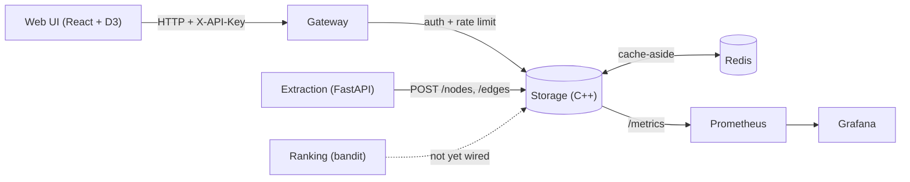

# Architecture

CortexKernel is a bi-temporal knowledge graph platform split into five
services. Storage is the core; everything else is optional infrastructure
layered around it.



Only the gateway is meant to be publicly reachable. Storage, Redis,
extraction, and ranking are internal-only in every deployment target
(`docker-compose.yml` and the `k8s/` manifests both reflect this — the
gateway is the only `NodePort` Service in Kubernetes).

## Services

**`services/storage`** (C++17) — the core. An in-memory `GraphStore`
(`Node`/`Edge` maps) with a `ContradictionDetector` on top of it, a
write-ahead log for durability, a Redis-backed cache-aside layer for hot
node reads, a Prometheus `/metrics` endpoint, and an HTTP API
(`httplib`, JSON via `nlohmann/json`). See [API.md](./API.md) for the
full endpoint list and [BENCHMARKS.md](./BENCHMARKS.md) for real
performance numbers.

**`services/gateway`** (Python, stdlib only) — the single public entry
point. Checks an `X-API-Key` header, applies a per-key token-bucket rate
limit, and proxies everything else straight through to storage. The
auth/rate-limit decision (`evaluate_request()`) is a pure function kept
separate from the HTTP handling so it's unit-testable without real
sockets.

**`services/extraction`** (Python, FastAPI) — turns raw text into typed
`Node`/`Edge` candidates and posts them to storage's REST API. Ships
with two backends behind one interface: `MockExtractionClient` (a
regex-based heuristic, zero dependencies, the default — the service
works out of the box with no API key) and `AnthropicExtractionClient`
(a real call to the Anthropic Messages API with a structured-JSON-output
prompt — written, but unverified without an `ANTHROPIC_API_KEY`).

**`services/extraction/ranking`** (Python, stdlib only) — an
epsilon-greedy multi-armed bandit (`EpsilonGreedyRanker`) that learns,
from feedback, which category of detected contradiction is worth
surfacing first. Exposed over its own tiny HTTP API (`POST /rank`,
`POST /feedback`). Not yet called by anything else in the system — see
[the roadmap note in CLAUDE.md](../CLAUDE.md) for what wiring it in
for real would look like.

## The data model

Every fact in the graph is a typed, bi-temporal `Edge`:

```
Edge {
  id, subject_id, predicate, object_id,
  edge_class: StatedValue | BehaviorEvidence | Fact | Emotion | Reflection,
  valid_at, recorded_at, invalid_at (optional),
  confidence, evidence_span, source_ref, layer, extractor
}
```

Edges are never deleted, only invalidated (`invalid_at` set) — the full
history of a belief is always recoverable. The one deliberately typed
distinction that makes automatic contradiction detection possible is
**`StatedValue`** (what someone says they believe or want) versus
**`BehaviorEvidence`** (what they actually did). See
[CONTRADICTION_DETECTION.md](./CONTRADICTION_DETECTION.md) for how that
distinction gets used.

## Design decisions worth knowing about

- **Layered, not monolithic, even within one service.** Inside storage:
  `GraphStore` only knows about nodes and edges; `ContradictionDetector`,
  `SemanticIndex`, `NodeCache`, and `WalWriter` are all separate modules
  built on top of it, each independently unit-tested. The DTO layer
  (`json_translation.hpp/cpp`) keeps the external JSON shape (`from`/`to`,
  string enum values) decoupled from the internal C++ struct field names.
- **Fail loud on bad input, fail soft on infrastructure.** Malformed
  JSON from a client gets a 400 with a clear message. A down Redis
  never breaks a request — `NodeCache`/`RedisClient` just always miss.
- **No heavyweight dependencies where a small one will do.** `RedisClient`
  is a from-scratch RESP client over a raw POSIX socket (no `hiredis`).
  Logging is a small dependency-free module, not `spdlog`. Both were
  deliberate calls to keep the dependency surface auditable.
- **Only the gateway is publicly reachable.** Every other service is
  internal-only in both `docker-compose.yml` and the Kubernetes
  manifests — this isn't an oversight, don't "fix" it by exposing storage
  directly.

For the full, session-by-session history of what's built versus
planned — including things that were tried and are currently blocked
(Terraform, the real Anthropic extraction path) — see
[`CLAUDE.md`](../CLAUDE.md), which is the working log this project was
actually built from.
